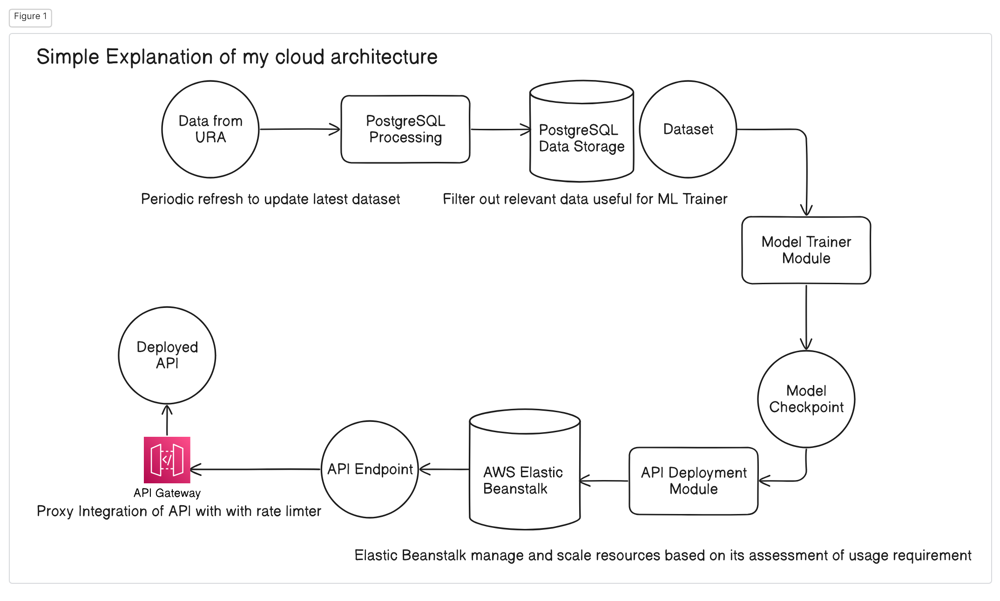

# SFS_MLEngineer_Assessment

This repository contains the solution to the Machine Learning Engineer assessment. The project focuses on predicting the price of new Executive Condominium (EC) flats at two specific points in time for the Housing & Development Board (HDB) of Singapore.

## Table of Contents
- [Background](#background)
- [Project Overview](#project-overview)
- [Cloud Architecture](#architecture)
- [Data Collection and Storage](#data-collection-and-storage)
- [Model Training](#model-training)
- [Assignment additional Proposal Task](#additional-task)
- [Frontend Interface](#frontend-interface)
- [How to Run](#how-to-run)

## Background
HDB is interested in monitoring price trends for Executive Condominiums (ECs) at key milestones:
1. 5 years after lease commencement (when ECs reach their Minimum Occupancy Period).
2. 10 years after lease commencement (when ECs become privatised).

The goal is to build a scalable and cost-effective ML solution to predict these price trends.

## Project Overview
The project is divided into the following tasks:
1. Set up a PostgreSQL database in a Docker container to store data from APIs and other sources. [Completed with process_data.ipynb]
2. Train a machine learning model for predicting EC prices. [Completed with modelling.ipynb]
3. Create a Python API exposing the model as a RESTful service and containerize it with Docker. [Completed with deployer.ipynb]
4. Deploy the API onto a cloud service. [Completed using AWS Elastic Beanstalk and API's sample usage available on cloud_inferencer.ipynb]
5. Proposal for Improvement on the above solution

## Cloud Architecture
The cloud architecture for this project is designed to be scalable, secure, and efficient, following a flow from data acquisition to model training and deployment. Here is a breakdown of the architecture:

1. **Data Acquisition and Storage**:
   - **PostgreSQL Processing**: The raw data from URA is processed in a PostgreSQL database to filter out relevant data for training the ML model.
   - **PostgreSQL Data Storage**: The processed and filtered data is then stored in the PostgreSQL database, ensuring it is ready for use in model training.

2. **Model Training**:
   - **Dataset**: The filtered dataset is used for training the machine learning model.
   - **Model Trainer Module**: This module is responsible for training the model using the dataset. The training process involves features selection, data preprocessing, model selection and, hyperparameter tunning.
   - **Model Checkpoint**: After training, the model is saved as a checkpoint to be used for deployment.

3. **API Deployment**:
   - **API Deployment Module**: The trained model is packaged into a Python API using Flask. The API is then containerized
   - **AWS Elastic Beanstalk**: The containerized API is deployed on AWS Elastic Beanstalk, which manages and scales the resources based on usage requirements. This ensures the API is always available and can handle varying traffic loads efficiently.
   - **API Endpoint**: The API exposes endpoints to interact with the model, allowing users to make predictions.

4. **API Gateway**:
   - **Deployed API**: The deployed API is integrated with an API Gateway to manage traffic, apply rate limiting, and provide a single entry point for accessing the API.
   - **Proxy Integration**: The API Gateway acts as a proxy to the API, adding a layer of security and reliability.

### Diagram


### Additional Notes
- **Scalability**: AWS Elastic Beanstalk manages and scales the API automatically, adjusting resources based on the usage pattern.
- **Security**: The API Gateway provides an additional security layer, including rate limiting to prevent misuse. Using the API Gateway provides plenty possiblities of continuous development to enhance security. (if given more time for the project assignment.)

## Data Acquisition and Storage
Most raw data processing are done here. It involves invoking URA's API to retrieve the latest dataset, filling up DB table rows, and filtering away instances that are irrelevant.

### Data model 
-Entities: Input Features, Target Feature
-Input Attributes: market_segment(str OCR/CCR/RCR), months_since_contract_date(int),	months_since_commence_date	area(int),	floor_range(str "01-05' '06-10' '11-15' '16-20' '21-25'")
-Output (Price/Target) Attributes: price (float)

## Model Training
The machine learning model was trained using a Cross Validation GridSearch method provided by scikit on the collected data. AI Assistant (cursor-small) was prompted the nature of the data and to provide a relevant extensive grid search parameters like models, hyperparamters to search for the best combination
Key steps in the training process included:
1. Data Cleaning and Preprocessing
2. Feature Engineering (Scaling, Normalizing, X features, and new input features like, Months passed since contract date till current and Months passed since commencement date till current)
3. Feature Selection (Pick starting from the most intuitive features)
3. Model Selection and Tuning (Assigned supervised Task and code generation work to small-cursor, a fine tunned LLM for code autocompletion, code generation, and code review)
4. Model Evaluation (Based on r2 and rmse metrics)

### Additional Notes about the Model
The Inferencer deploys 2 Model to perform prediction.
If inference data's transaction was performed 5 to 7.5 years from commencement year, 
a Model fine-tunned on with relevant transactions will be selected.
Else another Model fine-tunned with transactions date, 10 to 12.5 years from commencement year will be picked.
The Model was designed to include relevant fields (Input: **X**) for EC price prediction, such as:
- Market Segment
- Months passed since contract date till current (Sep 2024)
- Months passed since commencement date till current (Sep 2024)
- Size of Property (Area)
- Floor Range  (Higher floor typically fetch higher price)


## Assignment additional Proposal Task 
Model Monitoring metrics and solution (**Task 7**)
To ensure the model's performance and reliability, the following monitoring metrics are proposed:
- **Model Errors** (To continuous perform well, solution is to continuously receive feedback and re-train model as factors like concept drift degrades the accuracy)
- **Drift Detection** (Drift such as concept drift caused by new trend mechanism, like new MRT station, shopping malls and, schools, 
may make less features less important and some other features related to location being more important. Common drift detection libraries like Evidently, invoked through lambda function can also be used as solution)
- **Latency and Throughput of API Calls** (API is exposed to public, very important to monitor abuse / intention of abuse even with stringent rate limitter in place. Set budget limit notification, monitor through AWS cloudwatch are already in placed.)

Automation processes of feature engineering, model selection, and model monitoring (**Task 8**)
- **Automated feature engineering** (With new LLM technology, LLM agents can make full use of text description to automatically provide a discrete sentiment that is related to the house price, 
there are also libraries like FeatureTools and tsfresh, and the use of libraries like AutoML to integrate these automated features into full ML workflow including training and evaluation)
- **Automated Model Retraining** (Invoke Lambda function to periodically re-train based on latest data or upon drift detection)
- **Scheduled Model Evaluations** (Invoke Lambda function to periodically run python libraries like Evidently to evaluate drifts and performance)
- **Setup AWS CloudWatch** for monitoring API Gateway to track latency and throughput metrics, set threhold and alerts (already in place)


Model governance processes implemented include (**Task 9**):
- **Access Control**: Secure the API and database access. (In the event of up scaling, and the DB has to be moved to Cloud, 
the DB should not be exposed to public as there are no needs to do so. The cloud API will needs to distribute API-keys to user for greater usage controllability)
- **Versioning**: Version control for models and datasets. (Process of tracking and managing different versions of a machine learning model as it evolves. 
So that a rollback or comparison can be done to assessment for improvement / degradation and other unforeseeable reproducibility needs. 
Each artifacts produced can be stored in S3 bucket based on the time and date it was generated.)
- **Bias Testing**: Regular testing to ensure no Historical Bias and Sampling Bias in predictions. 
For example: Since past data sample of EC transaction has occured only in the Outside Central Region market segment, 
Model might not represent the trend outside of the market segment it has seen. 
If HDB is using it to predict price outside of OCR region it must bear in mind the possibility of bias to over represent OCR trends such that the performance degrades.


## Frontend Interface
cloud_inferencer.ipynb - simple illustration use case of cloud api


## How to Run
1. **Clone the repository**:
   ```bash
   git clone https://github.com/lolbus/SFS_MLEngineer_Assessment.git
